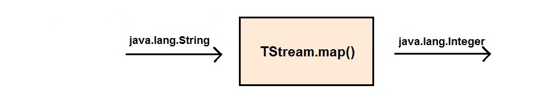

# Common Quarks Operations
In the first [getting started guide](quarks-getting-started), we covered a "hello world" Quarks application where we read from a device's simulated temperature sensor. Yet Quarks supports more operations than simple filtering. Data analysis and streaming require a suite of functionality, the most important components of which will be outlined below.

## TStream.map()
TStream.map() is arguably the most used method in the Quarks API. Its two main purposes are to perform stateful or stateless operations on a stream's tuples, and to produce a TStream with tuples of a different type from that of the calling stream.

<br>

#### Changing a TStream's Tuple Type
In addition to filtering tuples, TStreams support operations that *transform* tuples from one Java type to another by invoking the TStream.map() method.



This is useful in cases such as calculating the floating point average of a list of Integers, or tokenizing a Java String into a list of Strings. To demonstrate this, let's say we have a TStream which contains a few lines, each of which contains multiple words:

```java
    TStream<String> lines = topology.strings(
            "this is a line",
            "this is another line",
            "there are three lines now",
            "and now four"
        );
```

We then want to print the third word in each line. The best way to do this is to convert each line to a list of Strings by tokenizing them. We can do this in one line of code with the TStream.map() method:

```java
    TStream<List<String> > wordsInLine = lines.map(tuple -> Arrays.asList(tuple.split(" ")));
```

Since each tuple is now a list of strings, the *wordsInLine* stream is of type List<String>. As you can see, the map() method has the ability to change the type of the TStream. Finally, we can use the *wordsInLine* stream to print the third word in each line.

```java
    wordsInLine.sink(list -> System.out.println(list.get(2)));
```

As mentioned in the [getting started guide](quarks-getting-started), a TStream can be parameterized to any serializable Java type, including ones created by the user.

<br>


#### Performing Stateful Operations

In all previous examples, the operations performed on a TStream have been stateless; keeping track of information over multiple invocations of the same operation has not been necessary. What if we want to keep track of the number of Strings sent over a stream? To do this, we need our TStream.map() method to contain a counter as state.


This can be achieved by creating an anonymous Function class, and giving it the required fields.

```java
	TStream<String> streamOfStrings = ...;
    TStream<Integer> counts = streamOfStrings.map(new Function<String, Integer>(){
            int count = 0;
            @Override
            public Integer apply(String arg0) {
                count = count + 1;
                return count;
            }
        });
```

The *count* field will now contain the number of Strings which were sent over streamOfStrings. Although this is a simple example, the anonymous Function passed to TStream.map() can contain any kind of state! This could be a HashMap<K, T>, a running list of tuples, or any serializable Java type. The state will be maintained throughout the entire runtime of your application.

<br>
