## Visualizing and monitoring your application
The Quarks application console is a web application that enables you to visualize your application topology and monitor the tuples flowing through your application.  The kind of oplets used in the topology, as well as the stream tags included in the topology, are also visible in the console.

## Adding the console web app to your application
To use the console, you must use the Quarks classes that provide the service to access the console web application or directly call the `HttpServer` class itself, start the server and then obtain the console URL.

The easiest way to include the console in your application is to use the the `DevelopmentProvider` class. `DevelopmentProvider` is a subclass of `DirectProvider` and adds services such as access to the console web application and counter oplets used to determine tuple counts. You can get the URL for the console from the `DevelopmentProvider` using the `getService` method as shown in a hypothetical application shown below:

```
	import java.util.concurrent.TimeUnit;

	import quarks.console.server.HttpServer;
	import quarks.providers.development.DevelopmentProvider;
	import quarks.topology.TStream;
	import quarks.topology.Topology;

	public class TempSensorApplication {
		public static void main(String[] args) throws Exception {
		    TempSensor sensor = new TempSensor();
		    DevelopmentProvider dp = new DevelopmentProvider();
		    Topology topology = dp.newTopology();
		    TStream<Double> tempReadings = topology.poll(sensor, 1, TimeUnit.MILLISECONDS);
		    TStream<Double> filteredReadings = tempReadings.filter(reading -> reading < 50 || reading > 80);
		    filteredReadings.print();

		    System.out.println(dp.getServices().getService(HttpServer.class).getConsoleUrl());
		    dp.submit(topology);
		  }
	}
```

Note that the console URL is being printed to System.out. The filteredReadings are as well, since filteredReadings.print() is being called in the application.  You may need to scroll your terminal window up to see the output for the console URL.

Optionally, you can modify the above code in the application to have a timeout before submitting the topology, which would allow you to see the console URL before any other output is shown.  The modification would look like this:

```
// print the console URL and wait for 10 seconds before submitting the topology
System.out.println(dp.getServices().getService(HttpServer.class).getConsoleUrl());
try {
  TimeUnit.SECONDS.sleep(10);
} catch (InterruptedException e) {
  //do nothing
}
dp.submit(topology);
```

The other way to embed the console in your application is shown in the `HttpServerSample.java` example. It gets the HttpServer instance, starts it, and prints out the console URL.  Note that it does not submit a job, so when the console is displayed in the browser, there are no running jobs and therefore no Topology graph.  The example is meant to show how to get the `HttpServer` instance, start the console web app and get the URL of the console.

# Accessing the console
The console URL has the following format:

http://host_name:port_number/console

Once it is obtained from `System.out`, enter it in a browser window.  

If you cannot access the console at this URL, ensure there is a `console.war` file in the `webapps` directory.  If the `console.war` file cannot be found, an exception will be thrown (in std.out) indicating `console.war` was not found.

## ConsoleWaterDetector sample

To see the features of the console in action and as a way to demonstrate how to monitor a topology in the console, let's look at the `ConsoleWaterDetector` sample.
Prior to running any console applications, the `console.war` file must be built as mentioned above.  If you are building quarks from a Git repository, go to the top level Quarks directory and run `ant`.
Here is an example in my environment:

```
Susans-MacBook-Pro-247:quarks susancline$ pwd
/Users/susancline/git/quarks
Susans-MacBook-Pro-247:quarks susancline$ ant
Buildfile: /Users/susancline/git/quarks/build.xml

setcommitversion:

init:

suball:

init:

project.component:

compile:
...
[javadoc] Constructing Javadoc information...
[javadoc] Standard Doclet version 1.8.0_71
[javadoc] Building tree for all the packages and classes...
[javadoc] Generating /Users/susancline/git/quarks/target/docs/javadoc/quarks/analytics/sensors/package-summary.html...
[javadoc] Copying file /Users/susancline/git/quarks/analytics/sensors/src/main/java/quarks/analytics/sensors/doc-files/deadband.png to directory /Users/susancline/git/quarks/target/docs/javadoc/quarks/analytics/sensors/doc-files...
[javadoc] Generating /Users/susancline/git/quarks/target/docs/javadoc/quarks/topology/package-summary.html...
[javadoc] Copying file /Users/susancline/git/quarks/api/topology/src/main/java/quarks/topology/doc-files/sources.html to directory /Users/susancline/git/quarks/target/docs/javadoc/quarks/topology/doc-files...
[javadoc] Building index for all the packages and classes...
[javadoc] Building index for all classes...

all:

BUILD SUCCESSFUL
Total time: 3 seconds
```
This command will let you know that `console.war` was built and is in the correct place, under the `webapps` directory.

```
Susans-MacBook-Pro-247:quarks susancline$ find . -name console.war -print
./target/java8/console/webapps/console.war
```

Now we know we have built `console.war`, so we're good to go.
To run this sample from the command line:

```
Susans-MacBook-Pro-247:quarks susancline$ pwd
/Users/susancline/git/quarks
Susans-MacBook-Pro-247:quarks susancline$ java -cp target/java8/samples/lib/quarks.samples.console.jar:. quarks.samples.console.ConsoleWaterDetector
```

If everything is successful, you'll start seeing output.  You may have to scroll back up to get the URL of the console:

```
Susans-MacBook-Pro-247:quarks susancline$ java -cp target/java8/samples/lib/quarks.samples.console.jar:. quarks.samples.console.ConsoleWaterDetector
Mar 07, 2016 12:04:52 PM org.eclipse.jetty.util.log.Log initialized
INFO: Logging initialized @176ms
Mar 07, 2016 12:04:53 PM org.eclipse.jetty.server.Server doStart
INFO: jetty-9.3.6.v20151106
Mar 07, 2016 12:04:53 PM org.eclipse.jetty.server.handler.ContextHandler doStart
INFO: Started o.e.j.s.ServletContextHandler@614c5515{/jobs,null,AVAILABLE}
Mar 07, 2016 12:04:53 PM org.eclipse.jetty.server.handler.ContextHandler doStart
INFO: Started o.e.j.s.ServletContextHandler@77b52d12{/metrics,null,AVAILABLE}
Mar 07, 2016 12:04:53 PM org.eclipse.jetty.webapp.StandardDescriptorProcessor visitServlet
INFO: NO JSP Support for /console, did not find org.eclipse.jetty.jsp.JettyJspServlet
Mar 07, 2016 12:04:53 PM org.eclipse.jetty.server.handler.ContextHandler doStart
INFO: Started o.e.j.w.WebAppContext@2d554825{/console,file:///private/var/folders/0c/pb4rznhj7sbc886t30w4vpxh0000gn/T/jetty-0.0.0.0-0-console.war-_console-any-3101338829524954950.dir/webapp/,AVAILABLE}{/console.war}
Mar 07, 2016 12:04:53 PM org.eclipse.jetty.server.AbstractConnector doStart
INFO: Started ServerConnector@66480dd7{HTTP/1.1,[http/1.1]}{0.0.0.0:57964}
Mar 07, 2016 12:04:53 PM org.eclipse.jetty.server.Server doStart
INFO: Started @426ms
http://localhost:57964/console
Well1 alert, ecoli value is 1

Well1 alert, temp value is 48
Well3 alert, ecoli value is 1
```
Now point your browser to the URL displayed above in the output from running the Java command to launch the `ConsoleWaterDetector` application. In this case, the URL is `http://localhost:57964/console`.

Below is a screen shot of what you should see if everything is working properly:

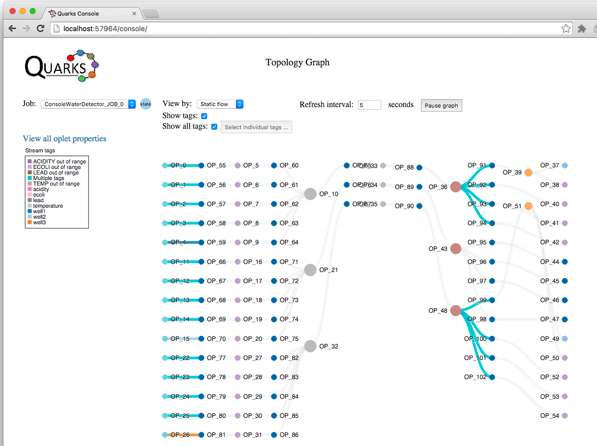

# ConsoleWaterDetector application scenario
The application is now running in your browser. Let's discuss the scenario for the application.
A county agency is responsible for ensuring the safety of residents well water.  Each well they monitor has four different sensor types:

* Temperature
* Acidity
* Ecoli
* Lead

The sample application topology monitors 3 wells:

* For the hypothetical scenario, Well1 and Well3 produce 'unhealthy' values from their sensors on occasion.  Well2 always produces 'healthy' values.  

* Each well that is to be measured is added to the topology.  The topology polls each sensor (temp, ecoli, etc) for each well as a unit.  A TStream&lt;Integer&gt; is returned from polling the toplogy and represents a sensor reading.  Each sensor reading for the well has a tag added to it with the reading type i.e, "temp", and the well id.  Once all of the sensor readings are obtained and the tags added, each sensor reading is 'unioned' into a single TStream&lt;JsonObject&gt;.  Look at the `waterDetector` method for details on this.
* Now, each well has a single stream with each of the sensors readings as a property with a name and value in the TStream&lt;JsonObject&gt;.  Next the `alertFilter` method is called on the TStream&lt;JsonObject&gt; representing each well.  This method checks the values for each well's sensors to determine if they are 'out of range' for healthy values. The `filter` oplet is used to do this. If any of the sensor's readings are out of the acceptable range the tuple is passed along. Those that are within an acceptable range are discarded.
* Next the applications `splitAlert` method is called on each well's stream that contains the union of all the sensor readings that are out of range.  The `splitAlert` method uses the `split` oplet to split the incoming stream into 5 different streams.  Only those tuples that are out of range for each stream, which represents each sensor type, will be returned. The object returned from `splitAlert` is a list of TStream&lt;JsonObject&gt; objects. The `splitAlert` method is shown below:
```
public static List<TStream<JsonObject>> splitAlert(TStream<JsonObject> alertStream, int wellId) {

		List<TStream<JsonObject>> allStreams = alertStream.split(5, tuple -> {
            if (tuple.get("temp") != null) {
            	JsonObject tempObj = new JsonObject();
            	int temp = tuple.get("temp").getAsInt();
            	if (temp <= TEMP_ALERT_MIN || temp >= TEMP_ALERT_MAX) {
            		tempObj.addProperty("temp", temp);
            		return 0;
            	} else {
            		return -1;
            	}

            } else if (tuple.get("acidity") != null){
            	JsonObject acidObj = new JsonObject();
            	int acid = tuple.get("acidity").getAsInt();
            	if (acid <= ACIDITY_ALERT_MIN || acid >= ACIDITY_ALERT_MAX) {
            		acidObj.addProperty("acidity", acid);
            		return 1;
            	} else {
            		return -1;
            	}
            } else if (tuple.get("ecoli") != null) {
            	JsonObject ecoliObj = new JsonObject();
            	int ecoli = tuple.get("ecoli").getAsInt();
            	if (ecoli >= ECOLI_ALERT) {
            		ecoliObj.addProperty("ecoli", ecoli);
            		return 2;
            	} else {
            		return -1;
            	}
            } else if (tuple.get("lead") != null) {
            	JsonObject leadObj = new JsonObject();
            	int lead = tuple.get("lead").getAsInt();
            	if (lead >= LEAD_ALERT_MAX) {
            		leadObj.addProperty("lead", lead);
            		return 3;
            	} else {
            		return -1;
            	}
            } else {
            	 return -1;
            }
        });

		return allStreams;
	}
```
* Next we want to get the temperature stream from the first well and put a rate meter on it to determine the rate at which the out of range values are flowing in the stream.
```
   List<TStream<JsonObject>> individualAlerts1 = splitAlert(filteredReadings1, 1);

   // Put a rate meter on well1's temperature sensor output
   Metrics.rateMeter(individualAlerts1.get(0));
```
* Next all the sensors for well 1 have tags added to the stream indicating the stream is out of range for that sensor and the well id.  Next a sink is added, passing the tuple to a `Consumer` that formats a string to `System.out` containing the well Id, alert type (sensor type) and value of the sensor.  
```
// Put a rate meter on well1's temperature sensor output
Metrics.rateMeter(individualAlerts1.get(0));
individualAlerts1.get(0).tag(TEMP_ALERT_TAG, "well1").sink(tuple -> System.out.println("\n" + formatAlertOutput(tuple, "1", "temp")));
individualAlerts1.get(1).tag(ACIDITY_ALERT_TAG, "well1").sink(tuple -> System.out.println(formatAlertOutput(tuple, "1", "acidity")));
individualAlerts1.get(2).tag(ECOLI_ALERT_TAG, "well1").sink(tuple -> System.out.println(formatAlertOutput(tuple, "1", "ecoli")));
individualAlerts1.get(3).tag(LEAD_ALERT_TAG, "well1").sink(tuple -> System.out.println(formatAlertOutput(tuple, "1", "lead")));
```
Output in the terminal window from the `formatAlertOutput` method will look like this:
```
Well1 alert, temp value is 86
Well3 alert, ecoli value is 2
Well1 alert, ecoli value is 1
Well3 alert, acidity value is 1
Well1 alert, lead value is 12
Well1 alert, ecoli value is 2
Well3 alert, lead value is 10
Well3 alert, acidity value is 10
```

Notice how only those streams that are out of range for the temperature sensor type show output.

## Detecting zero tuple counts

At the end of the `ConsoleWaterDetector` application is this snippet of code, added after the topology has been submitted:

```
dp.submit(wellTopology);

while (true) {
				MetricRegistry metricRegistry = dp.getServices().getService(MetricRegistry.class);
				SortedMap<String, Counter> counters = metricRegistry.getCounters();

				Set<Entry<String, Counter>> values = counters.entrySet();
				for (Entry<String, Counter> e : values) {
					if (e.getValue().getCount() == 0) {
						System.out.println("Counter Op:" + e.getKey() + " tuple count: " + e.getValue().getCount());
					}
				}
				Thread.sleep(2000);
		}
```

What this does is get all the counters in the `MetricRegistry` class and print out the name of the counter oplet they are monitoring along with the tuple count if it is zero.  Here is some sample output:

```
Counter Op:TupleCounter.quarks.oplet.JOB_0.OP_44 has a tuple count of zero!
Counter Op:TupleCounter.quarks.oplet.JOB_0.OP_45 has a tuple count of zero!
Counter Op:TupleCounter.quarks.oplet.JOB_0.OP_46 has a tuple count of zero!
Counter Op:TupleCounter.quarks.oplet.JOB_0.OP_47 has a tuple count of zero!
Counter Op:TupleCounter.quarks.oplet.JOB_0.OP_89 has a tuple count of zero!
Counter Op:TupleCounter.quarks.oplet.JOB_0.OP_95 has a tuple count of zero!
Counter Op:TupleCounter.quarks.oplet.JOB_0.OP_96 has a tuple count of zero!
Counter Op:TupleCounter.quarks.oplet.JOB_0.OP_97 has a tuple count of zero!
Counter Op:TupleCounter.quarks.oplet.JOB_0.OP_98 has a tuple count of zero!
```

To summarize what the application is doing:

- Unions all sensor type readings for a single well.
- Filters all sensor type readings for a single well, passing on an object that only contains tuples for the object that have at least one sensor type with out of range values.
- Splits the object that contained name/value pairs for sensor type and readings into individual sensor types returning only those streams that contain out of range values.
- Outputs to the command line the well id, sensor type and value that is out of range.
- Tags are added at various points in the topology for easier identification of either the well or some out of range condition.
- The topology contains counters to measure tuple counts since `DevelopmentProvider` was used.
- Individual rate meters were placed on well1 and well3's temperature sensors to determine the rate of 'unhealthy' values.
- Prints out the name of the counter oplets whose tuple counts are zero.

# Topology graph controls

Now that you have an understanding of what the application is doing, let's look at some of the controls in the console, so we can learn how to monitor the application.  Below is a screen shot of the top controls: the controls that affect the Topology Graph.

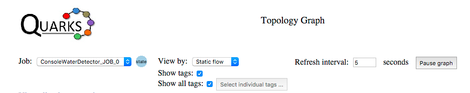

* **Job**: A drop down to select which job is being displayed in the Topology Graph.  An application can contain multiple jobs.
* **State**: Hovering over the 'State' icon shows information about the selected job.  The current and next states of the job, the job id and the job name.
* **View by**: This select is used to change how the topology graph is displayed.  The three options for this select are:
  - Static flow
  - Tuple count
  - Oplet kind
  - Currently it is set to 'Static flow'. This means the oplets (represented as circles in the topology graph) do not change size, nor do the lines or links (representing the edges of the topology graph) change width or position.  The graph is not being refreshed when it is in 'Static flow' mode.
* **Refresh interval**: Allows the user to select an interval between 3 - 20 seconds to refresh the tuple count values in the graph. Every X seconds the metrics for the topology graph are refreshed.  More about metrics a little bit later.
* **Pause graph**: Stops the refresh interval timer.  Once the 'Pause graph' button is clicked, the user must push 'Resume graph' for the graph to be updated, and then refreshed at the interval set in the 'Refresh interval' timer.  It can be helpful to pause the graph if multiple oplets are occupying the same area on the graph, and their names become unreadable. Once the graph is paused, the user can drag an oplet off of another oplet to better view the name and see the edge(s) that connect them.
* **Show tags**: If the checkbox appears in the top controls, it means:
  - The 'View by' layer is capable of displaying stream tags.
  - The topology currently shown in the topology graph has stream tags associated with it.
* **Show all tags**: Selecting this checkbox shows all the tags present in the topology.  If you want to see only certain tags, uncheck this box and select the button labeled 'Select individual tags ...'.  A dialog will appear, and you can select one or all of the tags listed in the dialog which are present in the topology.


The next aspect of the console we'll look at are the popups available when selecting 'View all oplet properties', hovering over an oplet and hovering over an edge (link).

The screen shot below shows the output from clicking on the 'View all oplet properties' link directly below the job selector:

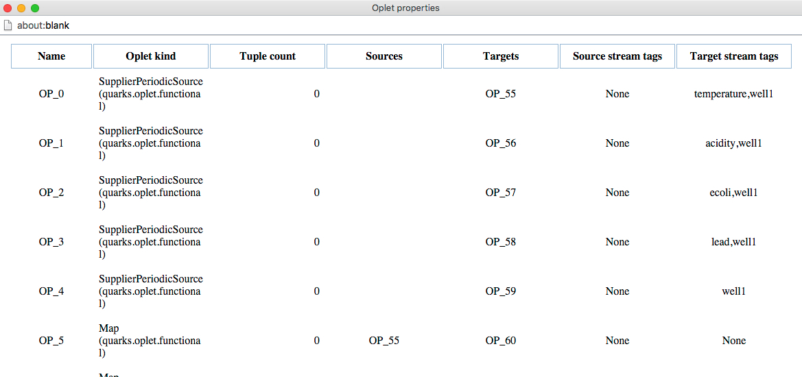

Looking at the sixth line in the table, where the Name is 'OP_5', we can see that the Oplet kind is a Map, a (quarks.oplet.functional.Map), the Tuple count is 0 (this is because the view is in Static flow mode - the graph does not show the number of tuples flowing in it), the source oplet is 'OP_55', the target oplet is 'OP_60', and there are no stream tags coming from the source or target streams.  Relationships for all oplets can be viewed in this manner.

Now, looking at the graph, if we want to see the relationships for a single oplet, we can hover over it. The image below shows the hover when we are over 'OP_5'.

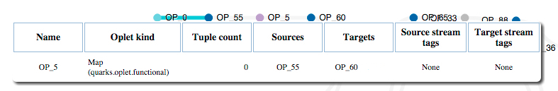

You can also hover over the edges of the topology graph to get information.  Hover over the edge (link) between 'OP_0' and 'OP_55'.  The image shows the name and kind of the oplet as the source, and the name and kind of oplet as the target.  Again the tuple count is 0 since this is the 'Static flow' view.  The last item of information in the tooltip is the tags on the stream.
One or many tags can be added to a stream.  In this case we see the tags 'temperature' and 'well1'.

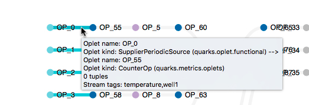

The section of the code that adds the tags 'temperature' and 'well1' is in the `waterDetector` method of the `ConsoleWaterDetector` class.

```
public static TStream<JsonObject> waterDetector(Topology topology, int wellId) {
  Random rNum = new Random();
  TStream<Integer> temp = topology.poll(() -> rNum.nextInt(TEMP_RANDOM_HIGH - TEMP_RANDOM_LOW) + TEMP_RANDOM_LOW, 1, TimeUnit.SECONDS);
  TStream<Integer> acidity = topology.poll(() -> rNum.nextInt(ACIDITY_RANDOM_HIGH - ACIDITY_RANDOM_LOW) + ACIDITY_RANDOM_LOW, 1, TimeUnit.SECONDS);
  TStream<Integer> ecoli = topology.poll(() -> rNum.nextInt(ECOLI_RANDOM_HIGH - ECOLI_RANDOM_LOW) + ECOLI_RANDOM_LOW, 1, TimeUnit.SECONDS);
  TStream<Integer> lead = topology.poll(() -> rNum.nextInt(LEAD_RANDOM_HIGH - LEAD_RANDOM_LOW) + LEAD_RANDOM_LOW, 1, TimeUnit.SECONDS);
  TStream<Integer> id = topology.poll(() -> wellId, 1, TimeUnit.SECONDS);

  // add tags to each sensor
  temp.tag("temperature", "well" + wellId);
  ```

# Legend

The legend(s) that appear in the console depend on the view currently displayed.  In the static flow mode, if no stream tags are present, there is no legend.  In this example we have stream tags in the topology, so the static flow mode gives us the option to select 'Show tags'.  If selected, the result is the addition of the Stream tags legend:

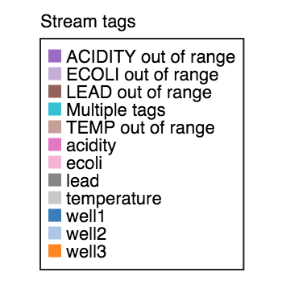

This legend shows all the tags that have been added to the topology, regardless of whether or not 'Show all tags' is checked or specific tags have been selected from the dialog that appears when the 'Select individual tags ...' button is clicked.

# Topology graph
Now that we've covered most of the ways to modify the view of the topology graph and discussed the application, let's look at the topology graph as a way to understand our application.

When analyzing what is happening in your application, here are some ways you might use the console to help you understand it:

* Topology of the application - how the edges and vertices of the graph are related
* Tuple flow  - tuple counts since the application was started
* The affect of filters or maps on the downstream streams
* Stream tags - if tags are added dynamically based on a condition, where the streams with tags are displayed in the topology

Let's start with the static flow view of the topology.  We can look at the graph, and we can also hover over any of the oplets or streams to better understand the connections.  Also, we can click 'View all oplet properties' and see the relationships in a tabular format.

The other thing to notice in the static flow view are the tags.  Look for any colored edges (the links between the oplets).
All of the left-most oplets have streams with tags.  Most of them have the color that corresponds to 'Multiple tags'.  If you hover over the edges, you can see the tags.  It's obvious that we have tagged each sensor with the sensor type and the well id.

Now, if you look to the far right, you can see more tags on streams coming out of a `split` oplet.  They also have multiple tags, and hovering over them you can determine that they represent out of range values for each sensor type for the well.  Notice how the `split` oplet, OP_43, has no tags in the streams coming out of it.  If you follow that split oplet back, you can determine from the first tags that it is part of the well 2 stream.

If you refer back to the `ConsoleWaterDetector` source, you can see that no tags were placed on the streams coming out of well2's split because they contained no out of range values.

Let's switch the view to Oplet kind now.  It will make more clear which oplets are producing the streams with the tags on them.
Below is an image of how the graph looks after switching to the Oplet kind view.

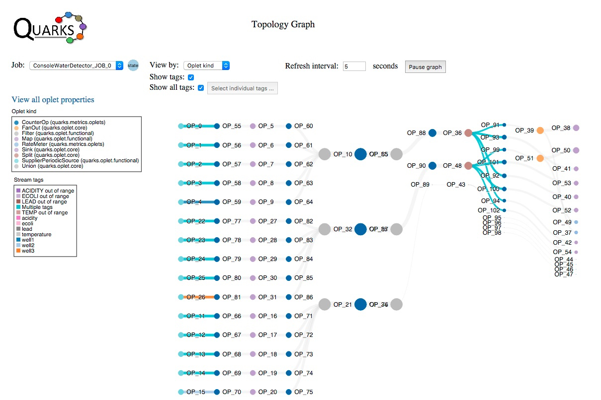

In the Oplet kind view the links are all the same width, but the circles representing the oplets are sized according to tuple flow.  Notice how the circles representing OP_10, OP_32 and OP_21 are large in relation to OP_80, OP_88 and OP_89.  As a matter of fact, we can't even see the circle representing OP_89.  Looking at OP_35 and then the Oplet kind legend, you can see by the color that it is a Filter oplet.  This is because the filter that we used against well2, which is the stream that OP_35 is part of returned no tuples.  This is a bit difficult to see. Let's look at the Tuple count view.

The Tuple count view will make it more clear that no tuples are following out of OP_35, which represents the filter for well2 and only returns out of range values.  You may recall that in this example well2 returned no out of range values.  Below is the screen shot of the graph in 'Tuple count' view mode.

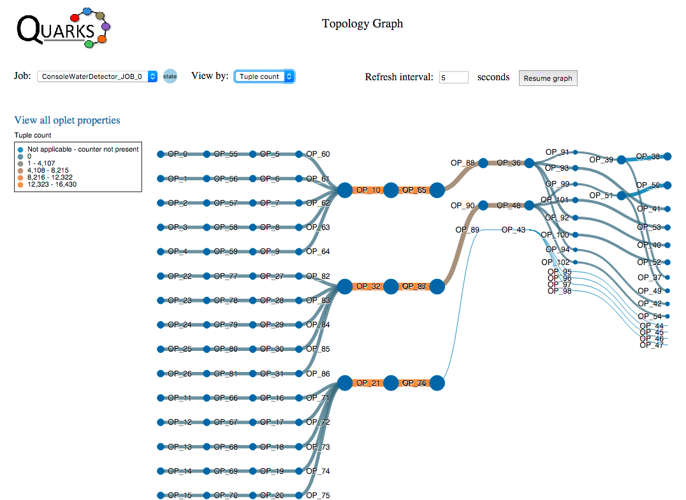

The topology graph oplets can sometimes sit on top of each other.  If this is the case, pause the refresh and use your mouse to pull down on the oplets that are in the same position. This will allow you to see their name.  Alternately, you can use the 'View all properties' table to see the relationships between oplets.

# Metrics
If you scroll the browser window down, you can see a Metrics section.  This section appears when the application contains the following:

* A ```DevelopmentProvider``` is used; this automatically inserts counters on the streams of the topology.
* A ```quarks.metrics.Metric.Counter``` or ```quarks.metrics.Metric.RateMeter``` is added to an individual stream.

## Counters

In the ```ConsoleWaterDetector``` application we used a ```DevelopmentProvider```.  Therefore, counters were added to most streams (edges) with the following exceptions (from the javadoc for ```quarks.metrics.Metric.Counter```):

*Oplets are only inserted upstream from a FanOut oplet.*

*If a chain of Peek oplets exists between oplets A and B, a Metric oplet is inserted after the last Peek, right upstream from oplet B.*

*If a chain of Peek oplets is followed by a FanOut, a metric oplet is inserted between the last Peek and the FanOut oplet.
The implementation is not idempotent; previously inserted metric oplets are treated as regular graph vertices. Calling the method twice will insert a new set of metric oplets into the graph.*

Also, the application inserts counters on well2's streams after the streams from the individual sensors were unioned and then split:

```
	List<TStream<JsonObject>> individualAlerts2 = splitAlert(filteredReadings2, 2);

	TStream<JsonObject> alert0Well2 = individualAlerts2.get(0);
	alert0Well2  = Metrics.counter(alert0Well2);
	alert0Well2.tag("well2", "temp");

	TStream<JsonObject> alert1Well2 = individualAlerts2.get(1);
	alert1Well2  = Metrics.counter(alert1Well2);
	alert1Well2.tag("well2", "acidity");

	TStream<JsonObject> alert2Well2 = individualAlerts2.get(2);
	alert2Well2  = Metrics.counter(alert2Well2);
	alert2Well2.tag("well2", "ecoli");

	TStream<JsonObject> alert3Well2 = individualAlerts2.get(3);
	alert3Well2  = Metrics.counter(alert3Well2);
	alert3Well2.tag("well2", "lead");
```

When looking at the select next to the label 'Metrics', make sure the 'Count, oplets OP_37, OP_49 ...' is selected.  This select compares all of the counters in the topology visualized as a bar graph.  An image is shown below:

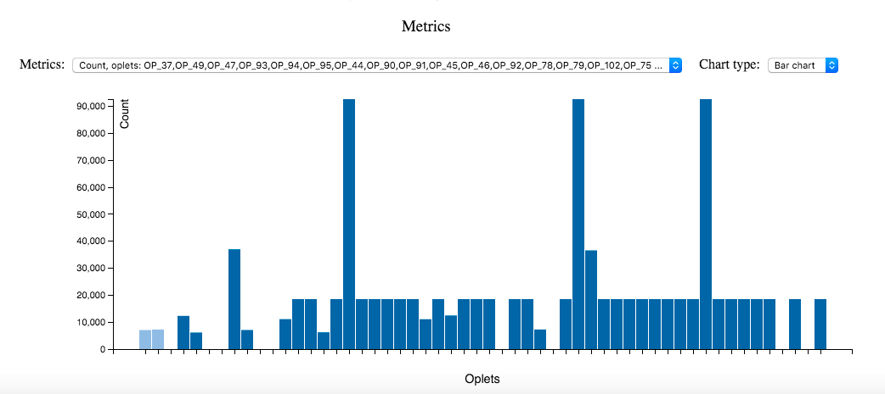

Hover over individual bars to get the value of the number of tuples flowing through that oplet since the application was started.  You can also see the oplet name.  You can see that some of the oplets have zero tuples flowing through them.
The bars that are the tallest and therefore have the highest tuple count are OP_76, OP_67 and OP_65.  If you look back up to the topology graph, in the Tuple count view, you can see that the edges (streams) surrounding these oplets have the color that corresponds to the highest tuple count (in the pictures above that color is bright orange in the Tuple count legend).

## RateMeters

The other type of metric we can look at are ```RateMeter``` metrics.  In the ```ConsoleWaterDetector``` application we added two rate meters here with the objective of comparing the rate of out of range readings between well1 and well3:

```
	List<TStream<JsonObject>> individualAlerts1 = splitAlert(filteredReadings1, 1);

	// Put a rate meter on well1's temperature sensor output
	Metrics.rateMeter(individualAlerts1.get(0));
	...
	List<TStream<JsonObject>> individualAlerts3 = splitAlert(filteredReadings3, 3);

	// Put a rate meter on well3's temperature sensor output
	Metrics.rateMeter(individualAlerts3.get(0));
```

RateMeters contain the following metrics for each stream they are added to:

  * Tuple count
  * The rate of change in the tuple count. The following rates are available for a single stream:
    * 1 minute rate change
    * 5 minute rate change
    * 15 minute rate change
    * Mean rate change

Now change the Metrics select to the 'MeanRate'.  In our example these correspond to oplets OP_37 and OP_49:

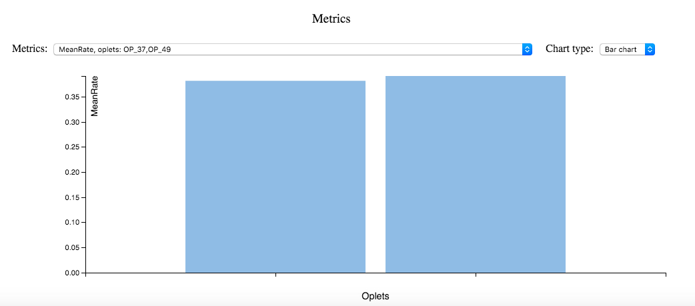

Hovering over the slightly larger bar, the one to the right, the name is OP_49.  Looking at the topology graph and changing the view to 'Static flow', follow the edges back from OP_49 until you can see an edge with a tag on it. You can see that OP_49's source is OP_51, whose source is OP_99.  The edge between OP_99 and it's source OP_48 has multiple tags.  Hovering over this stream, the tags are 'TEMP out of range' and 'well3'.

If a single Rate Meter is placed on a stream, in addition to plotting a bar chart, a line chart over the last 20 measures can be viewed.  For example, if I comment out the addition of the rateMeter for well1 and then rerun the application, the Metrics section will look like the image below.  I selected the OneMinuteRate and 'Line chart' for Chart type:

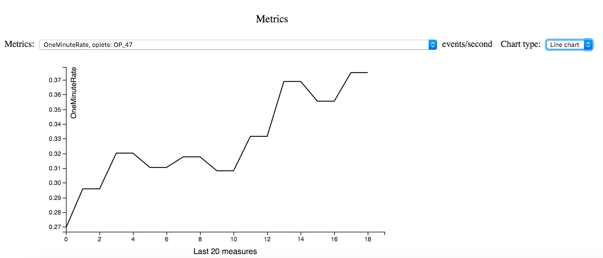

#Summary

The intent of the information on this page is to help you understand the following:

* How to add the console application to a Quarks application
* How to run the `ConsoleWaterDetector` sample
* The design/architecture in the `ConsoleWaterDetector` application
* The controls for the Topology graph are and what they do, including the different views of the graph
* The legend for the graph
* How to interpret the graph and use the tooltips over the edges and vertices, as well as the 'View all properties' link
* How to add counters and rate meters to a topology
* How to use the metrics section to understand tuple counters and rate meters
* How to correlate values from the metrics section with the topology graph

The Quarks console will continue to evolve and improve.  Please open an issue if you see a problem with the existing console, but more importantly add an issue if you have an idea of how to make the console better.  

The more folks write Quarks applications and view them in the console, the more information we can gather from the community about what is needed in the console.  Please consider making a contribution if there is a feature in the console that would really help you and others!
