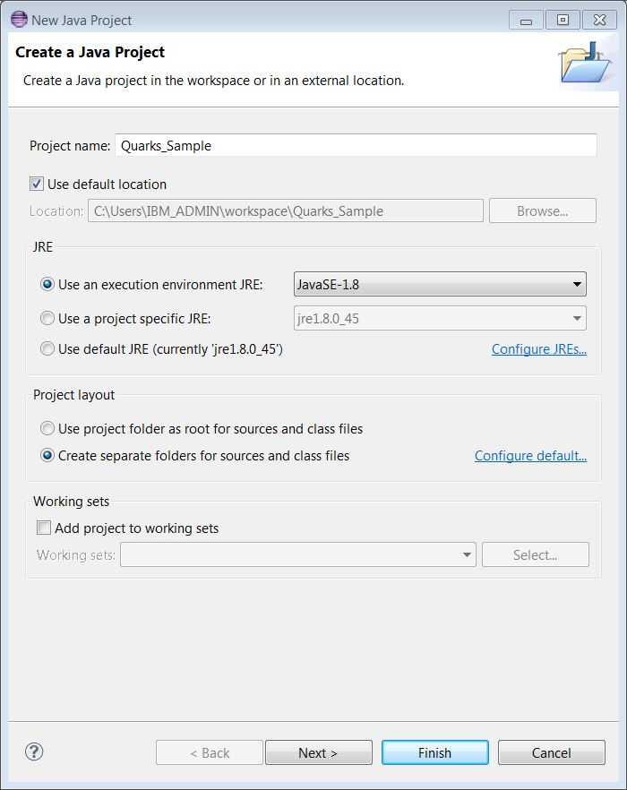
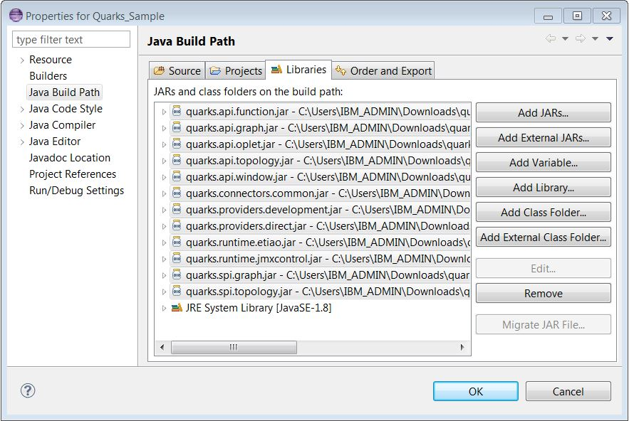

# Getting started with Quarks
Quarks is an open source programming model and runtime for edge devices that enables you to analyze streaming data on your edge devices. When you analyze on the edge, you can:

* Reduce the amount of data that you transmit to your analytics server

* Reduce the amount of data that you store

For more information, see the [Quarks overview](../overview)

## Quarks and streaming analytics
The fundamental building block of a Quarks application is a **stream**: a continuous sequence of tuples (messages, events, sensor readings, and so on).

The Quarks API provides the ability to process or analyze each tuple as it appears on a stream, resulting in a derived stream.

Source streams are streams that originate data for analysis, such as readings from a device's temperature sensor.

Streams are terminated using sink functions that can perform local device control or send information to centralized analytic systems through a message hub.

Quarks' primary API is functional where streams are sourced, transformed, analyzed or sinked though functions, typically represented as lambda expressions, such as `reading -> reading < 50 || reading > 80` to filter temperature readings in Fahrenheit.

## Downloading Quarks
To access Quarks, download a release from GitHub. We recommend downloading the [latest release](https://github.com/quarks-edge/quarks/releases/latest).

After you download and extract the Quarks package, you can set up your environment.

## Setting up your environment
Ensure that you are running a supported environment. For more information, see the [Quarks overview](../overview). This guide assumes you're running Java 8.

The Quarks Java 8 JAR files are located in the `quarks/java8/lib` directory.

1. Create a new Java project in Eclipse, and specify Java 8 as the execution environment JRE:

    

2. Modify the Java build path to include all of the JAR files in the `quarks\java8\lib` directory:

    

 
Your environment is set up! You can start writing your first Quarks application.

# Creating a simple application
If you're new to Quarks or to writing streaming applications, the best way to get started is to write a simple program.

Quarks is a framework that pushes data analytics and machine learning to *edge devices*. (Edge devices include things like routers, gateways, machines, equipment, sensors, appliances, or vehicles that are connected to a network.) Quarks enables you to process data locally---such as, in a car engine, on an Android phone, or Raspberry Pi---before you send data over a network.

For example, if your device takes temperature readings from a sensor 1,000 times per second, it is more efficient to process the data locally and send only interesting or unexpected results over the network. To simulate this, let's define a (simulated) TempSensor class:

  

  	import java.util.Random;

  	import quarks.function.Supplier;

  	/**
     * Every time get() is called, TempSensor generates a temperature reading.
     */
    public class TempSensor implements Supplier<Double> {
  		double currentTemp = 65.0;
  		Random rand;

  		TempSensor(){
  			rand = new Random();
  		}

  		@Override
  		public Double get() {
  			// Change the current temperature some random amount
  			double newTemp = rand.nextGaussian() + currentTemp;
  			currentTemp = newTemp;
  			return currentTemp;
  		}
  	}
  

Every time you call `TempSensor.get()`, it returns a new temperature reading. The continuous temperature readings are a stream of data that a Quarks application can process.

Our sample Quarks application processes this stream by filtering the data and printing the results. Let's define a TempSensorApplication class for the application:

  

	import java.util.concurrent.TimeUnit;

	import quarks.providers.direct.DirectProvider;
	import quarks.topology.TStream;
	import quarks.topology.Topology;

	public class TempSensorApplication {
		public static void main(String[] args) throws Exception {
		    TempSensor sensor = new TempSensor();
		    DirectProvider dp = new DirectProvider();      
		    Topology topology = dp.newTopology();
		    TStream<Double> tempReadings = topology.poll(sensor, 1, TimeUnit.MILLISECONDS);
		    TStream<Double> filteredReadings = tempReadings.filter(reading -> reading < 50 || reading > 80);

		    filteredReadings.print();
		    dp.submit(topology);
		  }
	}

  

To understand how the application processes the stream, let's review each line.

## Specifying a Provider
Your first step when you write a Quarks application is to create a
[`DirectProvider`](http://quarks-edge.github.io/quarks/docs/javadoc/index.html?quarks/providers/direct/DirectProvider.html) :

    DirectProvider dp = new DirectProvider();

A **Provider** is an object that contains information on how and where your Quarks application will run. A **DirectProvider** is a type of Provider that runs your application directly within the current virtual machine when its `submit()` method is called.

## Creating a topology
Additionally a Provider is used to create a
[`Topology`](http://quarks-edge.github.io/quarks/docs/javadoc/index.html?quarks/topology/Topology.html) instance :

    Topology topology = dp.newTopology();

In Quarks, **Topology** is a container that describes the structure of your application:

* Where the streams in the application come from

* How the data in the stream is modified

In the TempSensor application above, we have exactly one data source: the `TempSensor` object. We define the source stream by calling `topology.poll()`, which takes both a Supplier function and a time parameter to indicate how frequently readings should be taken. In our case, we read from the sensor every millisecond:

    TStream<Double> tempReadings = topology.poll(sensor, 1, TimeUnit.MILLISECONDS);

## Defining The TStream object
Calling `topology.poll()` to define a source stream creates a `TStream<Double>` instance, which represents the series of readings taken from the temperature sensor.

A streaming application can run indefinitely, so the TStream might see an arbitrarily large number of readings pass through it. Because a TStream represents the flow of your data, it supports a number of operations which allow you to modify your data.

## Filtering a TStream
In our example, we want to filter the stream of temperature readings, and remove any "uninteresting" or expected readings---specifically readings which are above 50 degrees and below 80 degrees. To do this, we call the TStream's `filter` method and pass in a function that returns *true* if the data is interesting and *false* if the data is uninteresting:

    TStream<Double> filteredReadings = tempReadings.filter(reading -> reading < 50 || reading > 80);

As you can see, the function that is passed to `filter` operates on each tuple individually. Unlike data streaming frameworks like [Apache Spark](https://spark.apache.org/), which operate on a collection of data in batch mode, Quarks achieves low latency processing by manipulating each piece of data as soon as it becomes available. Filtering a TStream produces another TStream that contains only the filtered tuples; for example, the `filteredReadings` stream.

## Printing to output
When our application detects interesting data (data outside of the expected parameters), we want to print results. You can do this by calling the `TStream.print()` method, which prints using  `.toString()` on each tuple that passes through the stream:

    filteredReadings.print();

Unlike `TStream.filter()`, `TStream.print()` does not produce another TStream. This is because `TStream.print()` is a **sink**, which represents the terminus of a stream.

In addition to `TStream.print()` there are other sink operations that send tuples to an MQTT server, JDBC connection, file, or Kafka cluster. Additionally, you can define your own sink by invoking `TStream.sink()` and passing in your own function.

## Submitting your application
Now that your application has been completely declared, the final step is to run your application.

`DirectProvider` contains a `submit()` method, which runs your application directly within the current virtual machine:

    dp.submit(topology);

After you run your program, you should see output containing only "interesting" data coming from your sensor:

	49.904032311772596
	47.97837504039084
	46.59272336309031
	46.681544551652934
	47.400819234155236
	...

As you can see, all temperatures are outside the 50-80 degree range. In terms of a real-world application, this would prevent a device from sending superfluous data over a network, thereby reducing communication costs.

## Further examples
This example demonstrates a small piece of Quarks' functionality. Quarks supports more complicated topologies, such as topologies that require merging and splitting data streams, or perform operations which aggregate the last *N* seconds of data (for example, calculating a moving average).

For more complex examples, see:

* [Quarks sample programs](../samples)
* [Common Quarks operations](../common-quarks-operations)
