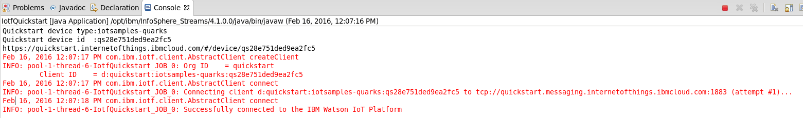
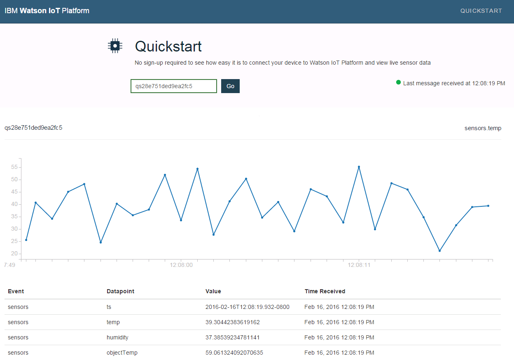

# Quarks to Quickstart Quickly!

IoT devices running quarks applications typically connect to back-end analytic systems through a message hub.
Message hubs are used to isolate the back-end system from having to handle connections from thousands to millions of devices.

An example of such a message hub designed for the Internet of Things is
[IBM Watson IoT Platform](https://internetofthings.ibmcloud.com/). This cloud service runs on IBM's Bluemix cloud platform
and Quarks provides a [connector](http://quarks-edge.github.io/quarks/docs/javadoc/index.html?quarks/connectors/iotf/IotfDevice.html).

You can test out the service without any registration by using its Quickstart service and the Quarks sample application:
[quarks.samples.connectors.iotf.IotfQuickstart](http://quarks-edge.github.io/quarks/docs/javadoc/index.html?quarks/samples/connectors/iotf/IotfQuickstart.html).

You can execute the class directly from Eclipse, or using the script: `quarks/java8/scripts/connectors/iotf/runiotfquickstart.sh`

When run it produces output like this, with a URL as the third line.



Pointing any browser on any machine to that URL takes you to a view of the data coming from the sample application.
This view is executing in Bluemix, thus the device events from this sample are being sent over the public internet
to the Quickstart Bluemix service.

Here's an example view:



## Quarks Code

The full source is at:
https://github.com/quarks-edge/quarks/blob/master/samples/connectors/src/main/java/quarks/samples/connectors/iotf/IotfQuickstart.java

The first step to is to create a `IotDevice` instance that represents the connection to IBM Watson IoT Platform Qucikstart service.

```java
        // Declare a connection to IoTF Quickstart service
        String deviceId = "qs" + Long.toHexString(new Random().nextLong());
        IotDevice device = IotfDevice.quickstart(topology, deviceId);
```

Now any stream can send device events to the Quickstart service by simply calling its `events()` method.
Here we map a stream of random numbers into JSON as the payload for a device event is typically JSON.

```java
          TStream<JsonObject> json = raw.map(v -> {
            JsonObject j = new JsonObject();
            j.addProperty("temp", v[0]);
            j.addProperty("humidity", v[1]);
            j.addProperty("objectTemp", v[2]);
            return j;
        });
```
  
  Now we have a stream of simulated sensor reading events as JSON tuples (`json`) we send them as events with event identifer (type) `sensors`  using `device`.
  
```java
      device.events(json, "sensors", QoS.FIRE_AND_FORGET);
```

It's that simple to send a Quarks stream to IBM Watson IoT Platform as device events.
